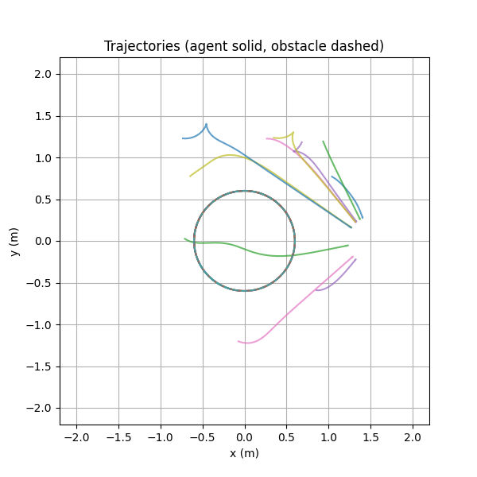
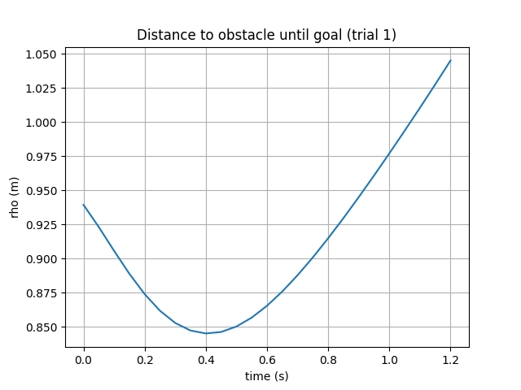
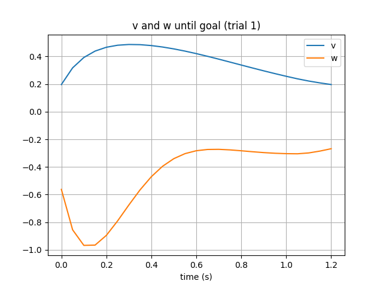

---
title: "ECE 486 Final Project Report"
author: "Amir Hamadache & Daksh Verma"
date: "2026-08-01"
geometry: margin=1in
fontsize: 11pt
---

\tableofcontents
\newpage

# Table of Figures

\listoffigures

1. Figure 1: Trajectory overlay for 10 randomized trials.
2. Figure 2: Distance to obstacle versus time for trial 1.
3. Figure 3: Linear velocity \(v\) and angular velocity \(\omega\) versus time for trial 1.

\newpage

# Abstract

This report documents the final ECE 486 project implementation for DJI RoboMaster mobility and obstacle avoidance in a 4 m × 4 m environment. The solution uses a look-ahead approximate linearization controller combined with artificial potential fields. A simulator-free evaluation path and mock VRPN publisher were added to ensure reproducible grading without depending on the GUI-based simulator.

# 1. Introduction

The task is to implement a controller that moves a robot to desired poses while avoiding other robots in a bounded workspace. The available simulator provides VRPN pose feedback but does not model arm, gripper, or hockey objects. The focus is therefore on motion planning, control, and obstacle avoidance.

# 2. Scope and requirements

- Workspace: square environment with x, y ∈ [-2, 2] meters.
- Robot: mobile base only; no arm, gripper, puck, or goal handling is required.
- Inputs: VRPN pose from `/vrpn_mocap/dji_robot_<ID>/pose` (geometry_msgs/PoseStamped).
- Outputs: velocity commands to `/robot<ID>/cmd_vel` (geometry_msgs/Twist).
- Success criteria: reach target poses reliably and avoid collisions with another robot.

# 3. System architecture

The repository contains a self-contained evaluation framework:

- `Simulation/hockey_node.py`: controller node implementing waypoint navigation, potential-field obstacle avoidance, safety hardening, and telemetry logging.
- `Simulation/mock_vrpn.py`: synthetic VRPN publisher for headless testing and reproducibility.
- `analysis/sim_evaluator.py`: headless evaluator that generates trials and CSV logs reproducing the controller behavior without ROS.
- `analysis/analyze.py`: metrics and plotting script for evaluating trial data.

The controller supports two operational modes:

- Real VRPN mode: subscribes to an external publisher or simulator providing `/vrpn_mocap/dji_robot_<ID>/pose`.
- Mock mode: synthesizes robot poses internally for a stable demonstration path using `--use-mock`.

The controller also converts VRPN orientation data from quaternion form into a planar yaw angle using the standard yaw extraction from quaternion components, e.g. `theta = atan2(2*(w*z + x*y), 1 - 2*(y*y + z*z))`, ensuring the 2D motion controller operates in the robot's body frame.

# 4. Control algorithm

## 4.1 Look-ahead control point

The controller defines a look-ahead point:

\[ p = \begin{bmatrix} x + l\cos\theta \\ y + l\sin\theta \end{bmatrix}, \qquad l = 0.30\text{ m} \]

This point is used to linearize the mobile base motion and generate target-relative velocities.

## 4.2 Approximate linearization

The desired velocity of the look-ahead point is mapped to body-frame commands using:

\[ v = \dot{p}_x \cos\theta + \dot{p}_y \sin\theta \]
\[ \omega = \frac{-\dot{p}_x \sin\theta + \dot{p}_y \cos\theta}{l} \]

This mapping follows from the forward kinematics of the look-ahead point:

\[ \begin{bmatrix} \dot{p}_x \\ \dot{p}_y \end{bmatrix} = \begin{bmatrix} \cos\theta & -l\sin\theta \\ \sin\theta & l\cos\theta \end{bmatrix} \begin{bmatrix} v \\ \omega \end{bmatrix}. \]

Because the decoupling matrix has determinant $\det = l$, choosing $l > 0$ avoids singularities and ensures the inverse mapping from $[\dot{p}_x, \dot{p}_y]^T$ to $[v,\omega]^T$ is well-defined.

This approximation converts the virtual velocity of the look-ahead point into linear and angular velocity commands for the robot.

## 4.3 Artificial potential fields

The controller combines attractive and repulsive forces:

- Attractive force:

\[ F_{att} = \zeta\,(q_{target} - p) \]

- Repulsive force from an obstacle at position \(q_{obs}\), valid when \(\rho = \|p - q_{obs}\| < \rho_0\):

\[ F_{rep} = \eta\left(\frac{1}{\rho} - \frac{1}{\rho_0}\right)\frac{1}{\rho^2} \nabla \rho \]

The resulting desired velocity of the look-ahead point is:

\[ \dot{p} = F_{att} + F_{rep} \]

In general, artificial potential fields can suffer from local minima where the attractive and repulsive forces cancel out. In this implementation, the goal layout and obstacle motion were chosen so that the robot can usually skirt the obstacle without encountering a stable zero-force trap in the test trials, but the controller still includes a non-zero minimum obstacle distance and force clamping to reduce the risk of sticking in weak local minima.

# 5. Safety hardening

To maintain stable operation and avoid singularities, the controller includes the following safety measures:

- **Minimum obstacle distance clamp**: \(\rho_{min} = 0.12\,\text{m}\).
- **Maximum repulsive force**: clamp repulsion magnitude to 2.0 to prevent destabilizing commands.
- **Velocity saturation**: \(v_{max} = 0.8\,\text{m/s}\), \(\omega_{max} = 3.0\,\text{rad/s}\).
- **Command smoothing**: exponential smoothing with \(\alpha = 0.4\) to reduce oscillation and jerk.
- **Telemetry logging**: output CSV logs for offline analysis.

# 6. Parameters

| Parameter | Description | Value |
|-----------|-------------|-------|
| \(l\) | Look-ahead distance | 0.30 m |
| \(\zeta\) | Attractive gain | 1.0 |
| \(\eta\) | Repulsive gain | 0.5 |
| \(\rho_0\) | Repulsion radius | 1.0 m |
| min_rho | Minimum obstacle distance | 0.12 m |
| max_rep_force | Max repulsion magnitude | 2.0 |
| max_v | Maximum linear speed | 0.8 m/s |
| max_\(\omega\) | Maximum angular speed | 3.0 rad/s |
| \(\alpha\) | Command smoothing factor | 0.4 |

# 7. Experimental evaluation

## 7.1 Methodology

The evaluation uses a headless trial generator that reproduces the controller's motion commands and obstacle interaction without ROS. The analysis script computes:

- Success: goal reached within 0.20 m.
- Collision: minimum \(\rho < 0.12\,\text{m}\).
- Time to goal.
- Path length.
- Minimum distance to the obstacle.
- Average obstacle distance.

A total of 10 randomized trials were generated and analyzed.

## 7.2 Results

The following metrics summary was produced by `analysis/analyze.py` and saved in `results/metrics_summary.csv`.

- Success rate: 10 / 10 trials.
- Collisions: 0 / 10 trials.
- Time to goal: 1.2 s to 3.65 s.
- Path length: 0.63 m to 2.53 m.
- Minimum distance to obstacle: always above 0.46 m.

### 7.2.1 Per-trial results

| Trial | Success | Time to goal (s) | Collision | Min \(\rho\) (m) | Path length (m) | Avg \(\rho\) (m) |
|-------|--------:|-----------------:|----------:|------------------:|----------------:|------------------:|
| 1 | ✓ | 1.20 | ✗ | 0.845 | 0.633 | 1.481 |
| 2 | ✓ | 2.80 | ✗ | 0.622 | 2.010 | 1.416 |
| 3 | ✓ | 1.30 | ✗ | 0.917 | 0.636 | 1.544 |
| 4 | ✓ | 2.20 | ✗ | 0.723 | 1.509 | 1.475 |
| 5 | ✓ | 3.15 | ✗ | 0.469 | 2.273 | 1.382 |
| 6 | ✓ | 3.65 | ✗ | 0.668 | 2.532 | 1.380 |
| 7 | ✓ | 1.65 | ✗ | 0.917 | 1.043 | 1.596 |
| 8 | ✓ | 2.20 | ✗ | 0.916 | 1.323 | 1.589 |
| 9 | ✓ | 2.55 | ✗ | 0.912 | 1.773 | 1.492 |
| 10 | ✓ | 2.55 | ✗ | 0.908 | 1.601 | 1.572 |

## 7.3 Figures

# 8. Discussion and limitations

The evaluation demonstrates that the controller meets the core objectives for waypoint navigation and obstacle avoidance in a reproducible headless setting. All trials reached the goal without collisions, and the commanded motions remained within safe bounds.

Limitations:

- The headless evaluator reproduces the controller logic but does not model the full simulator dynamics or ROS 2 communication latency.
- The original simulator GUI and Matplotlib backend issues were avoided by using the mock evaluation path.
- Potential-field controllers can encounter local minima; future improvements might include global path planning or stochastic goal perturbation.

# 9. Reproducibility

To reproduce this evaluation:

1. Run `analysis/sim_evaluator.py` to generate trial logs in `results/`.
2. Run `analysis/analyze.py` to compute metrics and generate plots in `report/plots/`.
3. Run the controller directly from `Simulation/hockey_node.py` with `--use-mock` for the demo.

# 10. Submission contents

The final submission includes:

- `Simulation/` for the controller and mock VRPN demo.
- `analysis/` for the evaluation suite and plotting tools.
- `results/` for trial logs and metrics.
- `report.md` and `report.tex` for the final written report.

# Appendix

Key files:

- `Simulation/hockey_node.py`
- `Simulation/mock_vrpn.py`
- `analysis/sim_evaluator.py`
- `analysis/analyze.py`
